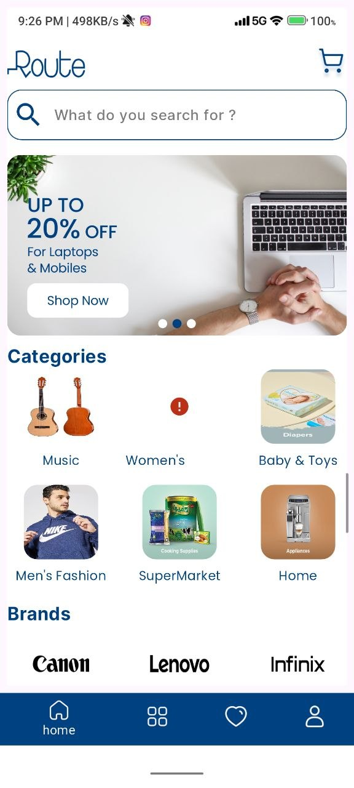
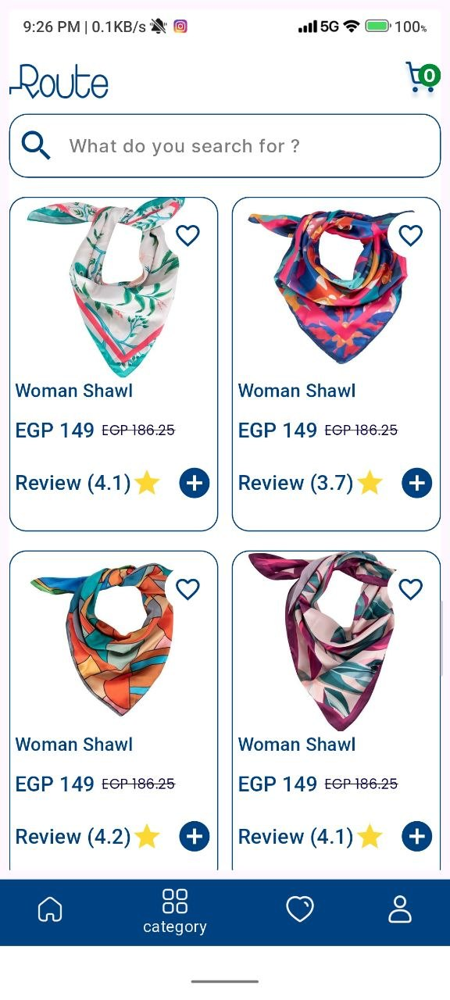
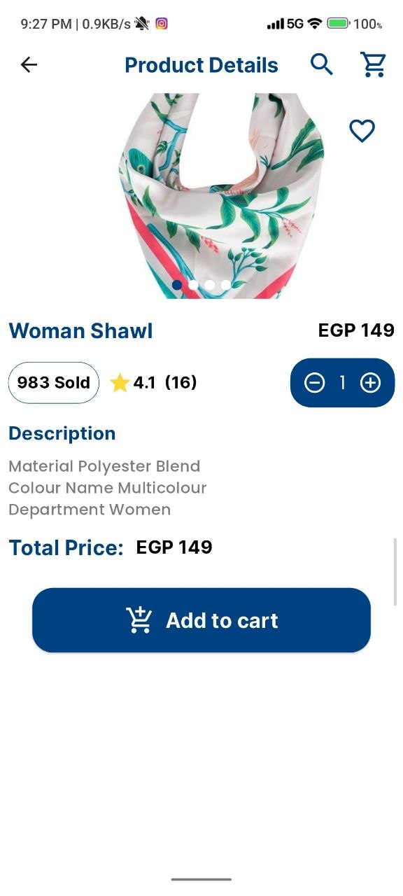

# 🛒 E-Commerce App

A Flutter-based E-Commerce mobile application built with Clean Architecture, BLoC state management, and REST API integration.

---

## 📸 Screenshots

<p float="left">



</p>

---

## ✨ Features

- 🔐 User Authentication (Login & Register)
- 🏠 Home Screen with Categories, Brands & Banners
- 📦 Product Listing & Product Details
- 🛒 Shopping Cart Management
- ❤️ Wishlist / Favorites
- 👤 User Profile

---

## 🏗️ Tech Stack

| Layer | Technology |
|---|---|
| Language | Dart |
| Framework | Flutter |
| State Management | BLoC / Cubit |
| Architecture | Clean Architecture |
| Dependency Injection | get_it & injectable |
| API | RESTful API + HTTP |
| Storage | Shared Preferences |

---

## 🗂️ Project Structure

```
lib/
├── core/           # Shared utilities, constants, network
├── features/
│   ├── auth/       # Login & Register
│   ├── home/       # Home screen
│   ├── products/   # Product listing & details
│   ├── cart/       # Shopping cart
│   └── profile/    # User profile
```

---

## 🚀 Getting Started

### Prerequisites
- Flutter SDK >= 3.0.0
- Dart SDK >= 3.0.0

### Installation

```bash
# Clone the repo
git clone https://github.com/shriefkoush/e_commerce_app.git

# Install dependencies
flutter pub get

# Run the app
flutter run
```

---

## 📦 Dependencies

```yaml
flutter_bloc: ^8.x
get_it: ^7.x
injectable: ^2.x
dio: ^5.x
shared_preferences: ^2.x
```

---

## 👨‍💻 Author

**Shrief Hassan** — Flutter Developer

[](https://www.linkedin.com/in/shrief-hassan-95884a22a)
[](https://github.com/shriefkoush)
